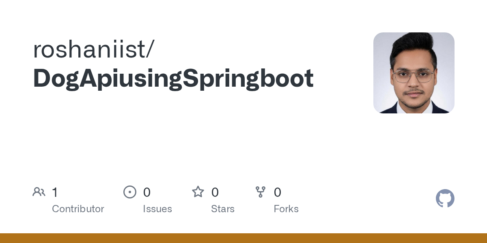
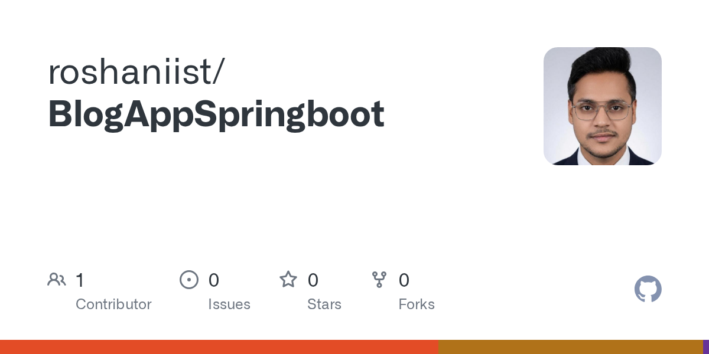
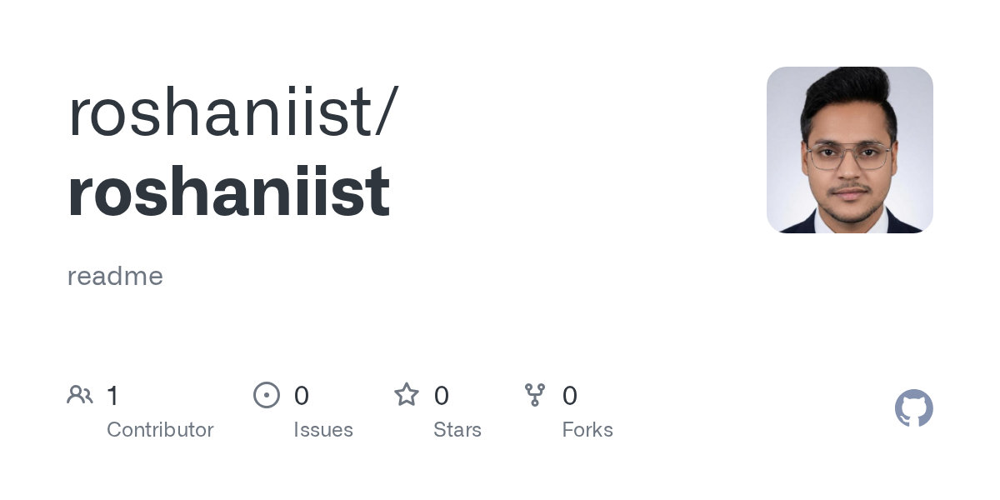

# Roshan Kumar — Java Developer Portfolio

A modern, responsive portfolio built to showcase backend engineering skills, project work, and contact details.

## Overview

This portfolio highlights:

- Java + Spring Boot backend development
- REST API design and integration
- SQL database work (MySQL/PostgreSQL)
- Real project case studies with tech stacks and outcomes

## Live Portfolio

- **Preview:** https://id-preview--6377d78a-6f2b-462f-8786-e488fb740721.lovable.app

## Professional Links

- **GitHub:** https://github.com/roshaniist
- **LinkedIn:** https://www.linkedin.com/in/roshankr01u/
- **Email:** kumarroshan62013@gmail.com

## Featured Projects

### 1) Expense Tracker Application
- **Repository:** https://github.com/roshaniist/Expense-Tracker-Application
- Built Spring Boot REST APIs for complete CRUD expense workflows
- Used MySQL + Hibernate for persistent transaction/category storage
- Added filtering and validation for cleaner daily tracking


### 2) Dog API Using Spring Boot
- **Repository:** https://github.com/roshaniist/DogApiusingSpringboot
- Integrated external dog-breed API responses in JSON
- Exposed clean Spring Boot endpoints for data delivery
- Added exception handling for stable API behavior



### 3) Blog App Spring Boot
- **Repository:** https://github.com/roshaniist/BlogAppSpringboot
- Developed backend modules for blog content management
- Structured frontend pages using HTML/CSS
- Organized routes and data flow for maintainability



### 4) School Management System
- **Repository:** https://github.com/roshaniist/School-Management-System-By-Using-Spring-Boot-
- Built modules for student, class, and staff workflows
- Implemented Spring Boot + MySQL data operations
- Followed layered architecture for scale and testability


### 5) GitHub Profile README
- **Repository:** https://github.com/roshaniist/roshaniist
- Structured profile branding and project highlights
- Kept links and technical summary concise and updated
- Improved discoverability of key repositories



## Tech Stack

- **Languages:** Java, SQL, JavaScript, HTML, CSS
- **Backend:** Spring Boot, JDBC, Hibernate, REST APIs
- **Databases:** MySQL, PostgreSQL
- **Tools:** Git, GitHub, Postman, IntelliJ IDEA, VS Code

## Local Setup

```bash
npm install
npm run dev
```

Then open the local URL shown in your terminal.

## Build for Production

```bash
npm run build
npm run preview
```

## Contact

- **Email:** kumarroshan62013@gmail.com
- **Phone:** +91 9572752717
